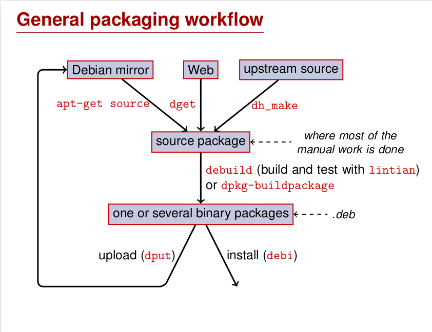

总之先上一下[官方（看起来比较新）的教程](https://www.debian.org/doc/manuals/packaging-tutorial/packaging-tutorial.pdf)


我们需要通过源代码包来构建 deb 包

### 拆个软件包
之前给的范例是 dash，可以先弄下 deb 包看看 `apt download dash`  
按照教程说是 ar 压缩包 `ar tv name.deb` 然后解压，可以看到三个文件
```
debian-binary: deb 文件格式的版本，"2.0\n" 纯纯文本文件哦
control.tar.gz: 软件包的元数据 (metadata)，包括
control, md5sums, (pre|post)(rm|inst), triggers, shlibs, …
ata.tar.gz: 软件包的数据文件
``` 
然后解压到文件夹 `dpkg-deb -x filename.deb /path/to/extract`  
我们一个个进行查看：
#### control 包
下面包括 `control  md5sums  postinst  postrm  prerm` 几个文件，control 应该就是 debian 文件夹里的 control 文件。`control  md5sums  postinst  postrm  prerm`   
`postinst`、`postrm` 和 `prerm` 是 Debian 软件包中的维护脚本，用于在软件包安装、升级和删除过程中执行特定的操作。这些脚本通常包含在 `control.tar.gz` 文件中。以下是对这三个脚本的解释：

1. **`postinst`（Post-Installation Script）**：
    - 这个脚本在软件包安装或升级后执行。
    - 常用于执行安装后的配置任务，例如设置文件权限、启动服务、更新配置文件等。

    示例：
    ```bash
    #!/bin/sh
    set -e

    # 更新配置文件
    if [ "$1" = "configure" ]; then
        # 执行配置任务
        echo "Configuring package..."
    fi

    exit 0
    ```

2. **`prerm`（Pre-Removal Script）**：
    - 这个脚本在软件包被删除或升级前执行。
    - 常用于执行删除前的清理任务，例如停止服务、备份配置文件等。

    示例：
    ```bash
    #!/bin/sh
    set -e

    # 停止服务
    if [ "$1" = "remove" ] || [ "$1" = "upgrade" ]; then
        # 执行清理任务
        echo "Stopping service..."
    fi

    exit 0
    ```

3. **`postrm`（Post-Removal Script）**：
    - 这个脚本在软件包被删除或升级后执行。
    - 常用于执行删除后的清理任务，例如删除临时文件、更新系统状态等。

    示例：
    ```bash
    #!/bin/sh
    set -e

    # 删除临时文件
    if [ "$1" = "remove" ]; then
        # 执行清理任务
        echo "Cleaning up..."
    fi

    exit 0
    ```

在你的 

index.md

 ) 文件中，你可以这样描述这些脚本：


### 维护脚本

在 Debian 软件包中，`postinst`、`prerm` 和 `postrm` 是用于在软件包安装、升级和删除过程中执行特定操作的维护脚本。这些脚本通常包含在 `control.tar.gz` 文件中。

1. `postinst`（Post-Installation Script）：

    - 这个脚本在软件包安装或升级后执行。
    - 常用于执行安装后的配置任务，例如设置文件权限、启动服务、更新配置文件等。

    示例：

```bash
    #!/bin/sh
    set -e

    # 更新配置文件
    if [ "$1" = "configure" ]; then
        # 执行配置任务
        echo "Configuring package..."
    fi

    exit 0
```

2. `prerm`（Pre-Removal Script）：

    - 这个脚本在软件包被删除或升级前执行。
    - 常用于执行删除前的清理任务，例如停止服务、备份配置文件等。

    示例：

    ```bash
    #!/bin/sh
    set -e

    # 停止服务
    if [ "$1" = "remove" ] || [ "$1" = "upgrade" ]; then
        # 执行清理任务
        echo "Stopping service..."
    fi

    exit 0
    ```

3. `postrm`（Post-Removal Script）：

    - 这个脚本在软件包被删除或升级后执行。
    - 常用于执行删除后的清理任务，例如删除临时文件、更新系统状态等。

    示例：

    ```bash
    #!/bin/sh
    set -e

    # 删除临时文件
    if [ "$1" = "remove" ]; then
        # 执行清理任务
        echo "Cleaning up..."
    fi

    exit 0
    ```

通过这些脚本，你可以在软件包的安装、升级和删除过程中执行特定的操作，以确保系统的正确配置和清理。

然后 rules 里面的 dh
```makefile
#!/ usr/bin/make -f
%:
dh $@  
# 下面都是覆写本身的内容 不然就直接默认执行
override_dh_auto_configure:
dh_auto_configure -- --with -kitchen -sink
override_dh_auto_build:
make world
```
%:
% 是一个通配符，表示任意目标。这一行定义了一个模式规则，意味着这个规则适用于任何目标。
`dh $@`：dh 是 Debhelper 工具的命令，Debhelper 是一组用于自动化 Debian 软件包构建过程的脚本集合。$@ 是一个 make 的自动变量，代表当前规则的目标。 这个很厉害

### 获得源代码包

在 `/etc/apt/source.list` 里面把 src 的注释取消（看了就知道了）


### 实操练习环节 1：修改 grep 软件包

通过 `apt-get source grep` 获得源码包，然后通过 `dpkg-source -x grep_2.12-2.dsc` 解压

### 实操练习环节 2：打包 GNUjump
```bash
wget http://ftp.gnu.org/gnu/gnujump/gnujump-1.0.8.tar.gz
mv gnujump-1.0.8.tar.gz gnujump_1.0.8.orig.tar.gz
tar xf gnujump_1.0.8.orig.tar.gz
cd gnujump-1.0.8/
dh_make -f ../gnujump-1.0.8.tar.gz #当前软件包类型：单程序文件（暂时）
```
下载软件包，然后
apt-file 命令  
含义：
apt-file主要用于查找某个文件属于哪个软件包。它通过查询软件包的文件列表来确定包含特定文件的软件包。这个功能在你知道需要一个特定文件（如某个库文件、配置文件或二进制文件），但不知道该文件所属软件包时非常有用。
示例和用途：
例如，你在编译一个程序时，提示缺少`libssl.so.1.1`文件。你可以使用`apt-file`来查找包含这个文件的软件包，命令如下：

`apt-file search libssl.so.1.1`

它会返回包含该文件的软件包名称，例如可能会显示`openssl-libs`，这样你就知道需要安装`openssl-libs`这个软件包来获取缺少的文件。不过，在使用apt-file之前，需要先更新它的文件列表数据库，使用命令`apt-file update`。这个命令会从软件源下载所有软件包的文件列表信息，存储在本地，以便后续的查询操作。  
所以这个命令还是很有用的……查看并且安装  
打包不好了，乐！