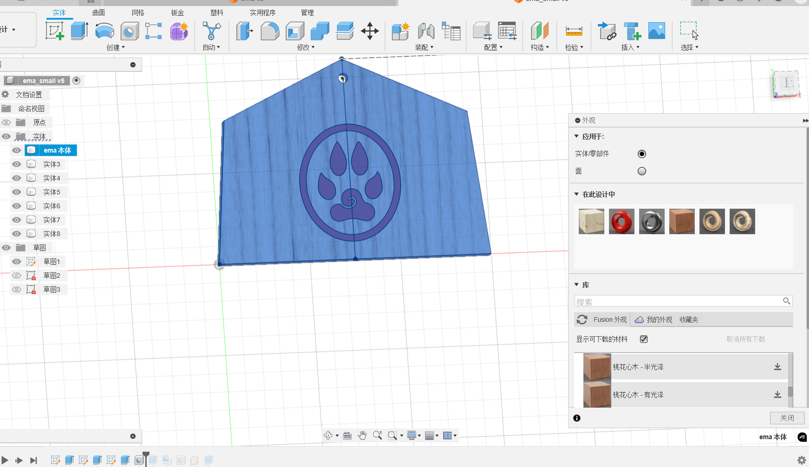
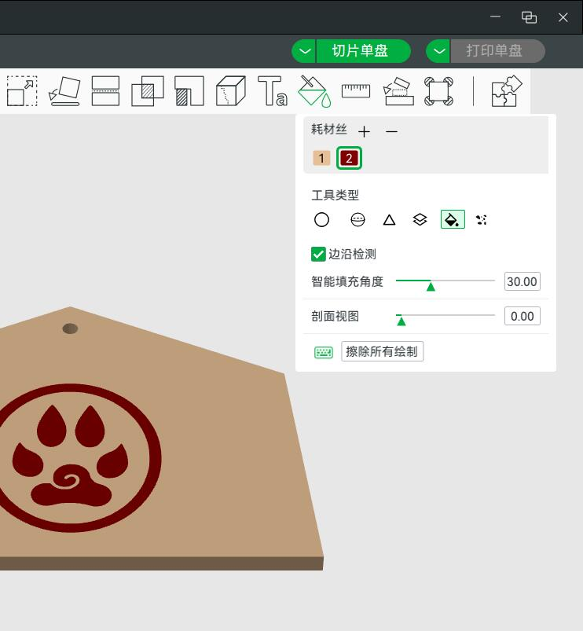

总之记录一下如果要求双色打印该如何建模。  
注意一下，因为使用 maker world（拓竹生态链）的话，Fusion 里的颜色是不会带走的。需要在 bamboo lab 重新上色一下。

首先需要插入 - svg 图片，选择一个草图平面，可以把这个 svg拖上去。  
为了额外上色，需要把实体区分开来。我是放到草图之后先挖（推拉 - 切割），再推拉填充（新建实体而不是合并）

然后右键，在选择外观。这里是拖拽上色，下面下载好了要拖动到上面的在此设计中。  
最后把其他的实体关闭显示，把设计拖动过去。

之后导出为 3mf 和 Fusion 的 archive 

导入 3mf 之后用上面的颜料桶，上色不同的耗材丝。