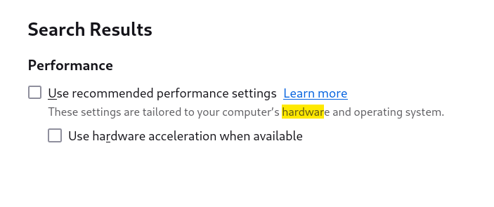
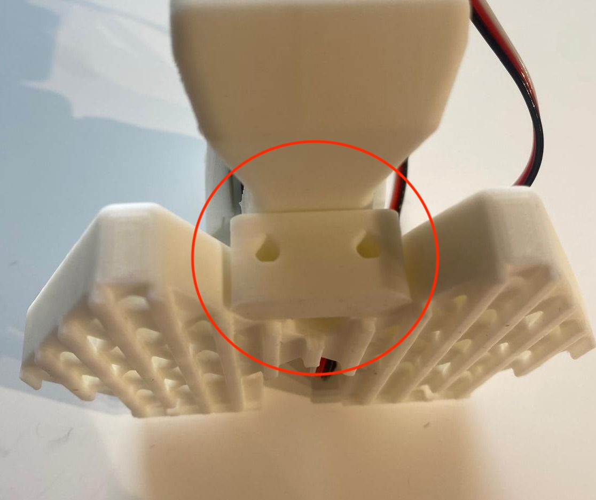
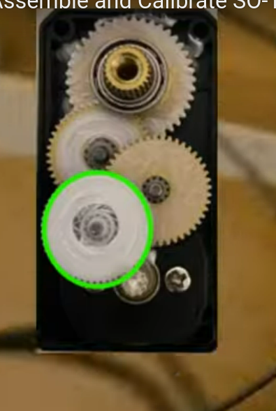

跑通这里给的 example，注意一下 clone 需要 [git-lfs](https://git-lfs.com/) 不然大文件无法下载，不知道 macos 和 window 是否有不同。
 seeed也有不错的[文档](https://wiki.seeedstudio.com/cn/lerobot_so100m/#%E6%A0%A1%E5%87%86%E6%9C%BA%E6%A2%B0%E8%87%82)

### 安装环境
安装之后记住默认安装路径，在默认 activate 上面选择 否 （不然每一次都会开启，会拖慢打开 Terminal 的速度）
`conda create -y -n lerobot python=3.10`
之后需要 `conda init` 来起始。把之前的 conda init 的代码块的注释掉

```bash
export PATH="/home/acy/miniconda3/bin:$PATH"
alias lr="source ~/miniconda3/bin/activate && conda activate lerobot"
```
把 miniconda 的可执行文件放在 path 变量下，之后使用alias，每次在 lerobot 的文件夹下就可以activate这个环境。然后如果要退出的时候连续输入 `conda deactivate`

进入到项目路径(比如 cd 到指定路径），然后安装依赖 `pip install -e ".[feetech]"`

如果是linux发行版
```bash
conda install -y -c conda-forge ffmpeg
pip uninstall -y opencv-python
conda install -y -c conda-forge "opencv>=4.10.0"
```

如果有遇到 ssl 认证问题，可以关闭 ssl 证书认证（虽然不安全但是work）
`conda install -y -c conda-forge "opencv>=4.10.0"`

### 寻找机械臂串口

首先按照[example](https://github.com/huggingface/lerobot/blob/main/examples/10_use_so100.md)的视频里面的做法，把usb和电源线接上。 `python lerobot/scripts/find_motors_bus_port.py` 跑一次找到这次是什么串口，Linux大概是是 `/dev/ttyACM0` 
可以通过 sudo chmod 666 /dev/ttyACM0 给予权限（如果权限不够的话。

修改串口的 config file，在 robot 的configs.py 里面 `lerobot/common/robot_devices/robots/configs.py`

```python
    leader_arms: dict[str, MotorsBusConfig] = field(
        default_factory=lambda: {
            "main": FeetechMotorsBusConfig(
                # port="/dev/tty.usbmodem58760431091", 这个大概是Windows的？
                port = "/dev/ttyACM0",
                motors={
```

### calibrate

这个应该是复位？一开始依赖库版本不对，额外安装 `conda install -c conda-forge jpeg libtiff`

## 总是出问题咱还是从组装开始吧

总结一下软件，无论用什么方法设置好 miniconda （以及不要让他每次都自动启动），安装依赖，如果不行关闭 ssl 验证，Debian 12 可能需要额外安装 `conda install -c conda-forge jpeg libtiff`  



注意一下如果 mime 无法播放就关闭硬件加速。

### 组装
这次测试了一下 follower arm 没有问题，组装一下 leader arm 在 Linux 系统里面为了不要每次 chmod 666，将当前用户加入 dialout `sudo usermod -aG dialout $USER`

然后连接每一个 motor，我是
```bash
python lerobot/scripts/configure_motor.py \
  --port /dev/ttyACM0 \
  --brand feetech \
  --model sts3215 \
  --baudrate 1000000 \
  --ID 1
```
注意不用扭上 horn，直接一个个标注好（记得标号）就可以开始拼装了。不过请拿个label，程序是按照 motor 上的 ID 控制的，如果装错了只能重来

### 开始拼装
**推荐先通读文字和视频，这两个都包含一部分重要信息。特别注意根据图片安装线的左右免得要重装**

**先装从臂（因为不用修改电机，有钳子的那个）再改主臂，这样不用改电机**  

除了使用 M2 * 5 的螺丝，注意不要把电机的螺丝拧下来装了（捂脸）  

在第五步使用两个螺丝从侧面打的时候，可以选用 M2 6 然后狠狠地打进去，需要打掉一点部件才能比较好的 fit in  

把 motor horn 先摁在电机上再打螺丝，注意孔洞位置。可以旋转一下arm把孔洞露出来，就能把螺丝打进去了。



装3 号电机的时候记得先插线。

**装主臂**
把已经标记好的 ID 1-6 电机打开四个螺丝，拆掉一个齿轮再还原



### 小 tips
有304纯色螺丝钉优先使用，黑色没有这个好，如果有内六角也优先使用，不容易滑丝。不过这个机子打印孔还是适合黑色的螺丝

### 组装完毕测试

校准从臂
```bash
python lerobot/scripts/control_robot.py \
  --robot.type=so100 \
  --robot.cameras='{}' \
  --control.type=calibrate \
  --control.arms='["main_follower"]'
```


这个应该已经失效了不推荐使用，这个file来自 `lerobot/common/robot_devices/robots/` 可以通过call 里面的 `run_arm_auto_calibration_so100` 先活动一下手臂（

校准主臂
```bash
python lerobot/scripts/control_robot.py \
  --robot.type=so100 \
  --robot.cameras='{}' \
  --control.type=calibrate \
  --control.arms='["main_leader"]'
```

`.cache/calibration/so100` 下面是校准文件，如果重新较重应该会直接覆写，或者你可以直接删除