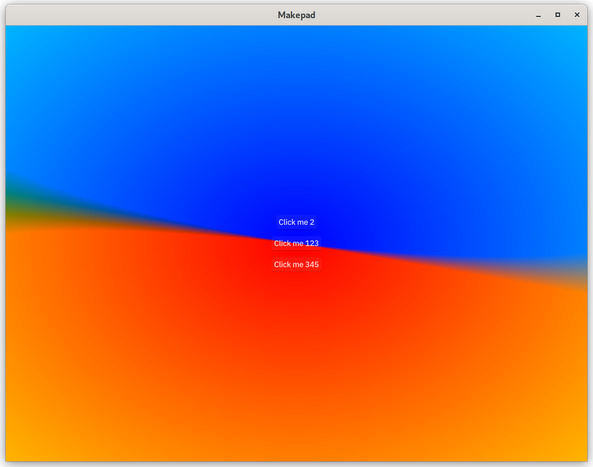
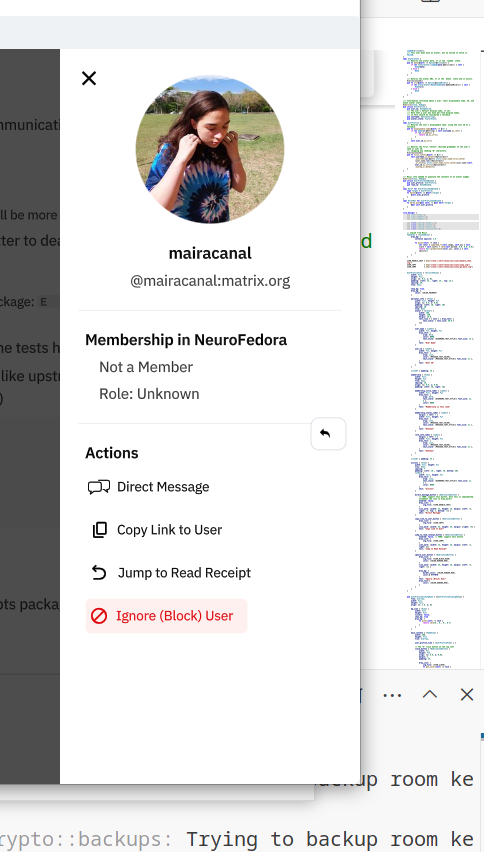
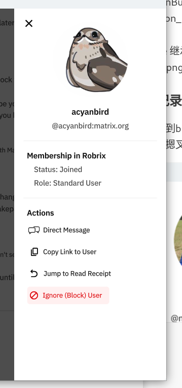

**为了入职加油！**
### 安装 makepad
clone 到 [rik分支](https://github.com/makepad/makepad/tree/rik)，直接按照 MacOS / PC 来安装就是了，下面的 Linux 是为了没有 X11 环境使用的……目前在 X11 可以使用，不知道wayland怎么样？
```
cd ~/projects/makepad
cargo run -p makepad-example-simple
```
然后就可以看到 running 了，不过一般来说 dock 那边没有出现图标……

结论是其他 robius 的 sample 在 Debian 下都没法跑，回到 sample 下进行工作吧！

### hello world

使用 simple 改装一下？simple 的 lib 和 main 只是简单进行了声明
```rust 
fn main(){
    makepad_example_simple::app::app_main()
}
```
```rust
// ...existing code...
pub use makepad_widgets;
pub mod app;
```

然后下面是主要的关节
```rust
use makepad_widgets::*;

live_design!{
    use link::theme::*;
    use link::shaders::*;
    use link::widgets::*;
    
    App = {{App}} {
        ui: <Root>{ // 这里的 ui 是 Root 组件的引用
            main_window = <Window>{
                body = <View>{
                    flow: Down, // 子组件按垂直方向排列
                    spacing: 10, // 子组件之间的间距为 10 像素
                    align: {
                        x: 0.5, // 水平方向居中对齐
                        y: 0.5  // 垂直方向居中对齐
                    },
                    show_bg: true,
                    draw_bg:{
                        fn pixel(self) -> vec4 {
                            let center = vec2(0.5, 0.5);
                            let uv = self.pos - center;
                            let radius = length(uv);
                            let angle = atan(uv.y, uv.x);
                            let color1 = mix(#f00, #00f, 0.5 + 10.5 * cos(angle + self.time));
                            let color2 = mix(#0f0, #ff0, 0.5 + 0.5 * sin(angle + self.time));
                            return mix(color1, color2, radius);
                        }
                    }
                    b0= <Button> {
                        text: "Click me 2"
                        draw_text:{color:#fff}
                    }
                    button1 = <Button> {
                        text: "Click me 123"
                        draw_text:{color:#fff}
                    }
                    button2 = <Button> {
                        text: "Click me 345"
                        draw_text:{color:#fff}
                    }
                }
            }
        }
    }
}  

app_main!(App); 
 
#[derive(Live, LiveHook)]
pub struct App {
    #[live] ui: WidgetRef, // 引用用户界面组件的根部件
    #[rust] counter: usize, // 计数器，用于记录按钮点击次数
 }
 
impl LiveRegister for App {
    fn live_register(cx: &mut Cx) {
        crate::makepad_widgets::live_design(cx); // 注册用户界面设计
    }
}

impl MatchEvent for App{
    fn handle_actions(&mut self, _cx: &mut Cx, actions:&Actions){
        if self.ui.button(id!(button1)).clicked(&actions) { // 检查 button1 是否被点击
            self.counter += 1; // 增加计数器的值
        }
    }
}

impl AppMain for App {
    fn handle_event(&mut self, cx: &mut Cx, event: &Event) {
        self.match_event(cx, event); // 匹配和处理事件
        self.ui.handle_event(cx, event, &mut Scope::empty()); // 处理用户界面事件，不匹配上下文
    }
}
```
结合[中文文档](https://project-robius-china.github.io/makepad-book/zh/guide/widget/index)来看的话，LiveRegister 和 AppMain 是必须要上来的，将 CX 这个核心进行注册，然后根据上下文处理事件。不过如果需要更新的话还得绑定其他的……这一次的话就直接在root下面写 Widget……这个是Widget吧？

  
之后出来是这样的，同时也可以将控件拆开 Widget 进行操作，这里用 hello Widget （顺便说一下 makepad 能run 好像是因为他用内置的 Widget，自己用的话会因为 x11 不工作编译不了（还是我用错了啥））  

### 使用多个文件
然后这里也可以把 Widget 单独分开来使用，参考 hello widgets
```rust
use makepad_widgets::*;

live_design!(
    use link::theme::*;
    use link::shaders::*;
    use link::widgets::*;

    pub Ui = {{Ui}} { // 使用双花括号引用和实例化 Ui 结构体
        align: {x: 0.5, y: 0.5} // 水平和垂直方向居中对齐
        flow: Down, // 子组件按垂直方向排列
        spacing: 10, // 子组件之间的间距为 10 像素
        body = <Label> { // 定义一个 Label 组件
            text: "Hello, world!" // 标签文本
            draw_text: {
                text_style: {font_size: 12.0}, // 文本样式，字体大小为 12.0
            }
        }
        b0= <Button> { // 按钮组件
            text: "Click me 2"
            draw_text:{color:#fff}
        }
    }
);

#[derive(Live, LiveHook, Widget)]
pub struct Ui {
    #[deref]
    deref: View, // 引用 View 组件
}

impl Widget for Ui {
    fn handle_event(&mut self, cx: &mut Cx, event: &Event, scope: &mut Scope) {
        self.deref.handle_event(cx, event, scope); // 处理事件
    }

    fn draw_walk(&mut self, cx: &mut Cx2d, scope: &mut Scope, walk: Walk) -> DrawStep {
        self.deref.draw_walk(cx, scope, walk) // 绘制组件
    }
}
```
我在里面添加了一些别的，然后在 app 里面直接引用 Ui

```rust
use makepad_widgets::*;

live_design!(
    use link::theme::*;
    use link::shaders::*;
    use link::widgets::*;
    use crate::ui::*; // 引用 ui.rs 文件中的内容

    App = {{App}} { // 使用双花括号引用和实例化 App 结构体
        ui:<Root>{ // 定义 Root 组件
            <Window>{ // 定义 Window 组件
                body = <Ui> {} // 使用 Ui 组件
            }
        } 
    }
);

#[derive(Live, LiveHook)]
struct App {
    #[live]
    ui: WidgetRef, // 引用用户界面组件的根部件
}

impl AppMain for App {
    fn handle_event(&mut self, cx: &mut Cx, event: &Event) {
        self.ui.handle_event(cx, event, &mut Scope::empty()); // 处理事件
    }
}

impl LiveRegister for App {
    fn live_register(cx: &mut Cx) {
        makepad_widgets::live_design(cx);
        crate::ui::live_design(cx); // 注册 ui.rs 中的 live_design
    }
}

app_main!(App); // 定义应用程序的入口点
```
这样就可以，更加有条理的运行。看这两个例子都用了 root，然后是 Window 组件！

### 分析 robrix
每一个组件都有 draw_bg
login 是单独出来的可以先看看这个……但是没法退出了！RobrixTextInput 是自定义组件，继承自 TextInput（反正没法输入中文还是上游的锅）  

- RobrixTextInput 对，上游的textinput也无法输入中文……来自 shared/styles.rs 稍微猜猜看，可能是没有 IME 支持？可惜以前没有研究过太多，总之是对于生成的，可以输入文字的框，颜色大小进行define
- RobrixIconButton 继承自 Button - IconButton shared/icon_button.rs 更改了一些颜色和布局，更适合 UI
- SsoButton 封装 SsoImage 的，可以点击，手势是爪子
```rust
SsoButton = <RoundedView> {
        width: Fit,
        height: Fit,
        cursor: Hand,
        visible: true,
        padding: 10,//按钮内容与按钮边框之间会有 10 像素的间距。
        // margin: 10,
        margin: { left: 16.6, right: 16.6, top: 10, bottom: 10}
        draw_bg: {
            border_width: 0.5,
            border_color: (#6c6c6c),
            color: (COLOR_PRIMARY)
        }
    }
```
- SsoImage 继承 Image,也是限定了大小布局（应该换个更加高清的 png 图片的）和 SsoButton 一起结合起来使用
```rust
facebook_button = <SsoButton> {
                            image = <SsoImage> {
                                source: dep("crate://self/resources/img/facebook.png")
                            }
                        }
```
像这样


### robrix bug 记录
一边学习一边找到bug  
首先是图标的分辨率不够，sso我记得有 svg 版本？就算没有也可以找清楚一点的。robrix logo应该可以做 svg，看看难度  
聊天的时候点击其他人图片可以显示，但是没法退出了，摁叉叉没用要 ESC 
  
自己的图像变形了! 反正 cinny 那边是没问题的

单独聊天可以关闭，集体聊天点击会直接蹦跶出 reply 没法关闭……应该是 reply 这个占据太多了！所以导致查看界面这里被遮盖了？

  
是的，就是因为 reply 的逻辑优先（？） 在看 profile 上，所以没法正常关闭 —— 可能的解决方法，把 reply 的摁左键变成摁右键，这样就不冲突了！
