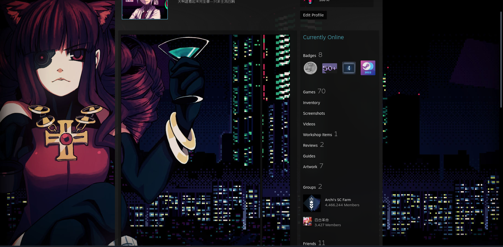
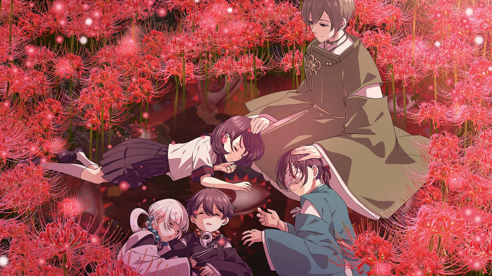

嘛，就是又开始玩Steam了，记录一下怎么将背景做成一幅图的样子：

好看吧！
#### 美化背景前提
首先需要把等级提升到 10，这个可以通过合成卡片，完成社区任务达成，或者直接花钱找tb……  
#### 美化用工具
参考这个[贴子](https://steamlevelu.com/zh/faq/how_to_make_a_nice_profile_on_steam)，反正我也用不着动图，只要能够把背景搞定就好！
不过看起来 steam.design 只支持 Steam 背景……那就需要自己动手了！
[四目神](https://steamuserimages-a.akamaihd.net/ugc/18673004985457747/DDAC4E87D2F81D5DE08C2A86A40904D4090FF90D/?imw=5000&imh=5000&ima=fit&impolicy=Letterbox&imcolor=%23000000&letterbox=false)

真的美丽之物……但是需要自己动手裁剪了！啊……我知道了，两边是没法改变的qwq
