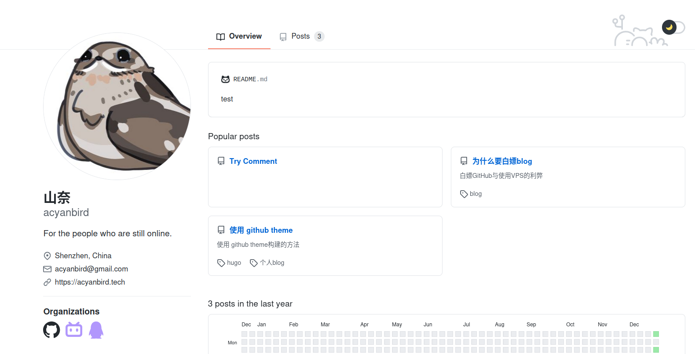

  
搭建个人 blog 记录生活或者技术内容，无论是从学习还是乐趣的角度都是很棒的体验~ 因此许多程序员会反复使用各种框架各种方法搭建自己的网站。  
今天给大家推荐一个虽然刚接触不久，但是觉得在维护和编写上都很方便的框架 hugo ，以及可以把个人博客同样变成 GitHub style 的主题~ 最重要的是借用GitHub Page 服务可以免费上线！本次分享会带领大家快速搭建自己的网站，欢迎带上电脑参加唷

### 事先声明
本人也只是刚刚接触 hugo，但是觉得这套工具十分好用，斗胆和各位分享一下！