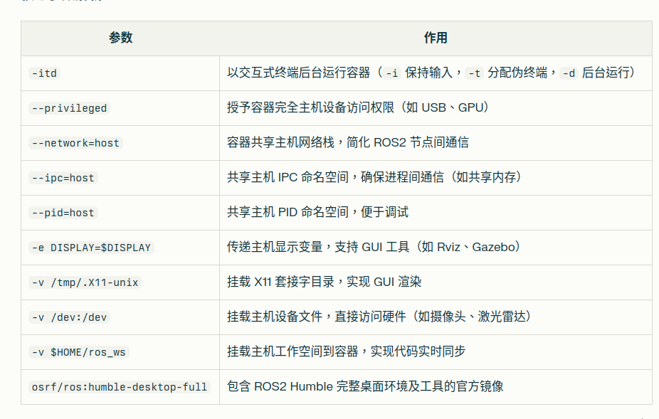

# 在 Debian 上安装和使用 Docker

在 Debian 上安装和使用 Docker 的步骤比较简单。以下是详细指南：

## 安装 Docker

1. **更新包索引**：
   ```bash
   sudo apt update
   ```

2. **安装必要的依赖包**：
   ```bash
   sudo apt install apt-transport-https ca-certificates curl gnupg lsb-release
   ```

3. **添加 Docker 官方 GPG 密钥**：
   ```bash
   curl -fsSL https://download.docker.com/linux/debian/gpg | sudo gpg --dearmor -o /usr/share/keyrings/docker-archive-keyring.gpg
   ```

4. **设置稳定版仓库**：
   ```bash
   echo "deb [arch=$(dpkg --print-architecture) signed-by=/usr/share/keyrings/docker-archive-keyring.gpg] https://download.docker.com/linux/debian $(lsb_release -cs) stable" | sudo tee /etc/apt/sources.list.d/docker.list > /dev/null
   ```

5. **更新包索引并安装 Docker**：
   ```bash
   sudo apt update
   sudo apt install docker-ce docker-ce-cli containerd.io
   ```

6. **验证安装**：
   ```bash
   sudo docker run hello-world
   ```

## 配置用户权限（可选）

默认情况下，Docker 命令需要 root 权限。为了避免每次使用 `sudo`，可以将当前用户添加到 docker 组：

```bash
sudo usermod -aG docker $USER
```

注销并重新登录，或运行以下命令应用组更改：
```bash
newgrp docker
```

## 基本 Docker 使用

1. **查看 Docker 信息**：
   ```bash
   docker info
   ```

2. **搜索镜像**：
   ```bash
   docker search ubuntu
   ```

3. **拉取镜像**：
   ```bash
   docker pull ubuntu
   ```

4. **查看所有镜像**：
   ```bash
   docker images
   ```

5. **运行容器**：
   ```bash
   docker run -it ubuntu bash
   ```

6. **查看正在运行的容器**：
   ```bash
   docker ps
   ```

7. **查看所有容器（包括已停止的）**：
   ```bash
   docker ps -a
   ```

8. **启动、停止、重启容器**：
   ```bash
   docker start 容器ID或名称
   docker stop 容器ID或名称
   docker restart 容器ID或名称
   ```

9. **删除容器**：
   ```bash
   docker rm 容器ID或名称
   ```

10. **删除镜像**：
    ```bash
    docker rmi 镜像ID或名称
    ```

## 使用 Docker Compose（可选）

如果需要管理多个容器，可以安装 Docker Compose：

```bash
sudo apt install docker-compose
```

通过创建 `docker-compose.yml` 文件来定义和运行多容器应用程序。

### 安装 ros2

```bash
docker run -itd \
  --name=ros_humble \
  --privileged \
  --network=host \
  --ipc=host \
  --pid=host \
  -e DISPLAY=$DISPLAY \
  -v /tmp/.X11-unix:/tmp/.X11-unix \
  -v /dev:/dev \
  -v $HOME/ros_ws:/root/ros_ws \
  osrf/ros:humble-desktop-full \
  bash
```



### v 的作用

数据双向同步：宿主机目录的修改会实时反映到容器内，反之亦然。

路径映射：格式为 -v /宿主机路径:/容器内路径，例如：