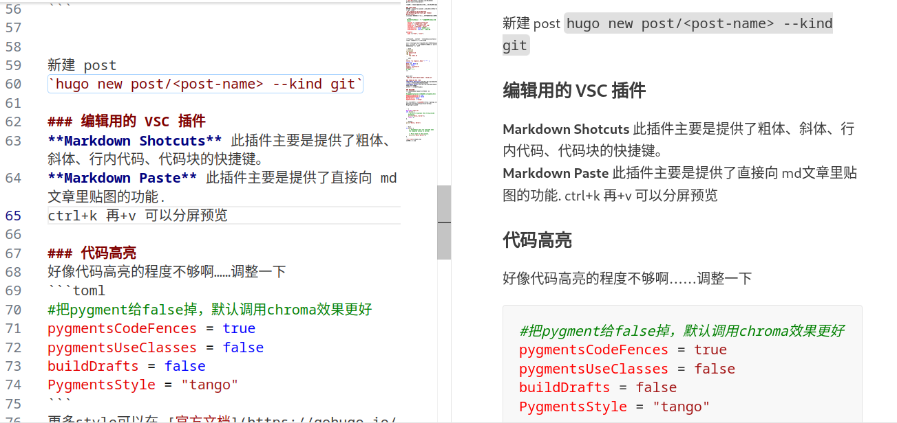
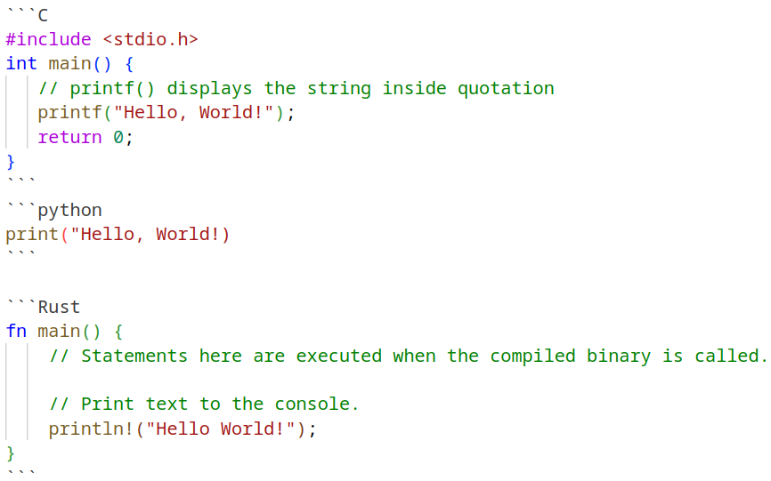

### 使用 git theme
---
[主题链接](https://github.com/MeiK2333/github-style/tree/master)

找了很多 theme，最后决定直接使用GitHub版本了！

### 安装 theme
首先跟着官方教程把 ananke 主题安装好，然后再下载 git theme  
`git submodule add git@github.com:MeiK2333/github-style.git themes/github-style`  
官方给了配置文件，稍微进行更改就可以。注意这里

```toml
 #userStatusEmoji = "😀" 不需要这个emoji 就注释掉
  favicon = "/images/github.png"
  avatar = "/images/ava_c.png"
  headerIcon = "/images/ava_c.png"
  location = "Shenzhen, China"
  enableGitalk = false #首先注释掉
  enableSearch = true #添加本地搜索

[outputs]
  home = ["html", "json"]
  ```

  
在根目录（和 content 一个目录下）创建static/images 把你的头像放在这个下面

我在 arhcetype 下建立了模版，采用叶子包的方法，给每一个 post 单独建立文件夹，这样每个 post 的图片就不会混杂在一起啦

```bash
//目录结构
archetypes
├── default.md
└── git
    └── index.md
```
```yaml
---
title: "{{ replace .Name "-" " " | title }}"
date: {{ .Date }}
draft: false
author: "acyanbird"
summary: ""
# tags: [""]
---
```


新建 post
`hugo new post/<post-name> --kind git`

### 编辑用的 VSC 插件
**Markdown Shotcuts** 此插件主要是提供了粗体、斜体、行内代码、代码块的快捷键。  
**Markdown Paste** 此插件主要是提供了直接向 md文章里贴图的功能.
ctrl+k 再+v 可以分屏预览  
或者右键tab直接预览 ctrl+shift+v



### 托管到 GitHub Page
其实应该在 ananke 的时候尝试的……算了已经这样了，按照官方教程走一波！

简简单单初始化……然后上传 blog，注意主题最好按照 sub-module 的方式提交免得出现错误！其实有强制嵌套的办法，我之前还用过是啥我忘了（）  

然后按照[官网](https://gohugo.io/hosting-and-deployment/hosting-on-github/)的指示一路下行就没有什么问题。值得注意的是，如果你使用的有子目录（比如 example.org/aaa），那可以把 toml 的图片链接设置成相对路径

```toml
  favicon = "images/ava_c_trans.png" #标签页的那个小图标，先不管
  avatar = "images/ava_c.png"
  headerIcon = "images/ava_c.png"
```
在 根目录建立`static/images`，复制粘贴图片  
然后在 `content/post` 下面新建 images 文件夹，把用到的图片也复制粘贴一份

### 使用 gitalk

### 自定义域名
之前我的两个网站都使用了子域名，现在就用顶点域名吧！反正也是从 GitHub 学生包白嫖滴  
[设置顶级域名](https://docs.github.com/zh/pages/configuring-a-custom-domain-for-your-github-pages-site/managing-a-custom-domain-for-your-github-pages-site)需要使用 A （IPV4）或者 AAAA （IPV6）记录，之前用子域名好像只用个 CNAME 来着？

### 添加社交媒体

该说不说这个 [icon 站](https://fontawesome.com/icons/bilibili) 挺好的！我无论如何都要把 b 站弄上去嗷~

### 代码高亮
好像代码高亮的程度不够啊……调整一下
```toml
#把pygment给false掉，默认调用chroma效果更好
pygmentsCodeFences = true
pygmentsUseClasses = false
buildDrafts = false
PygmentsStyle = "tango"
```
更多style可以在 [官方文档](https://gohugo.io/getting-started/configuration-markup/#highlight)上获取


```C
#include <stdio.h>
int main() {
   // printf() displays the string inside quotation
   printf("Hello, World!");
   return 0;
}
```
```python
print("Hello, World!)
```

```Rust
fn main() {
    // Statements here are executed when the compiled binary is called.

    // Print text to the console.
    println!("Hello World!");
}
```

嗯这样顺眼多了