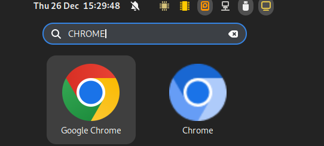
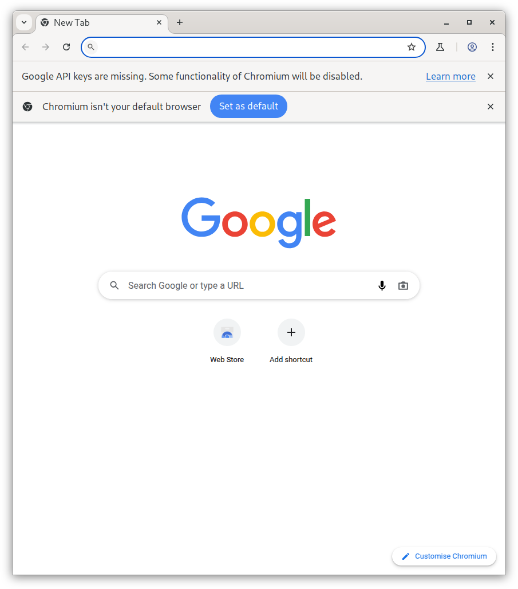

那么比起上次的空包，这次使用包含二进制的包，打包好之后能正常运行并且包含 desktop 文件。  
### 开始安装
这两个脚本文件分别是

```bash
chrome-133.0.6917.0/
├── dh_make_create.sh
├── dh_pak.sh
├── opt
│   └── apps
│       └── chrome
│           └── files
└── usr
    └── share
        ├── applications
        │   └── chrome.desktop
        └── icons
            └── hicolor
```
这里和 deepin 的标准不一样，需要将 Desktop 文件放到 usr 里面
```bash
# dh_make_create.sh
#!/bin/sh

#build "debian"
dh_make --createorig -s -n -y

#rm unused files
rm debian/*.ex debian/*.EX
rm -rf debian/*.docs debian/README debian/README.*

#make install file
echo "opt/ /" > ./debian/install
```
```bash
#dh_pak.sh
#!/bin/sh

#build deb
debuild -b -us -uc -tc
```

在 opt-apps-\<appid>-files-\<appid> 里面放置二进制的文件

```
opt
└── apps
    └── chrome
        └── files
            └── chrome
```
然后把 desktop 和 icon 放在 usr 里面
```
usr
└── share
    ├── applications
    │   └── chrome.desktop
    └── icons
        └── hicolor
            └── 48x48
                └── apps
                    └── chrome.png
```
其中的 48x48 是尺寸，最后 icon 要改成包名
最后的 desktop 文件（用来显示在目录里）

```
[Desktop Entry]
Categories=Network;WebBrowser;
Name=Chrome
Name[zh_CN]=Chrome浏览器
Keywords=google;browser
Keywords[zh_CN]=谷歌;浏览器
Comment=BAccess the Internet.
Comment[zh_CN]=访问互联网。
Exec=/opt/apps/chrome/files/chrome/chrome
Icon=chrome
Type=Application
Terminal=false
StartupWMClass=chrome
StartupNotify=true
MimeType=audio/aac;application/aac;
```
之后执行 `dh_make_create.sh`，不过在 install 文件里要加上一行
```
opt/ /
usr/ /
```
这样在安装的时候 usr 文件夹里的文件会安装到继起的 /usr 文件夹下  
最后执行 `dh_pak.sh`，会出现两个包，不过安装 `chrome_133.0.6917.0_amd64.deb` 这个包就行


### 安装效果

