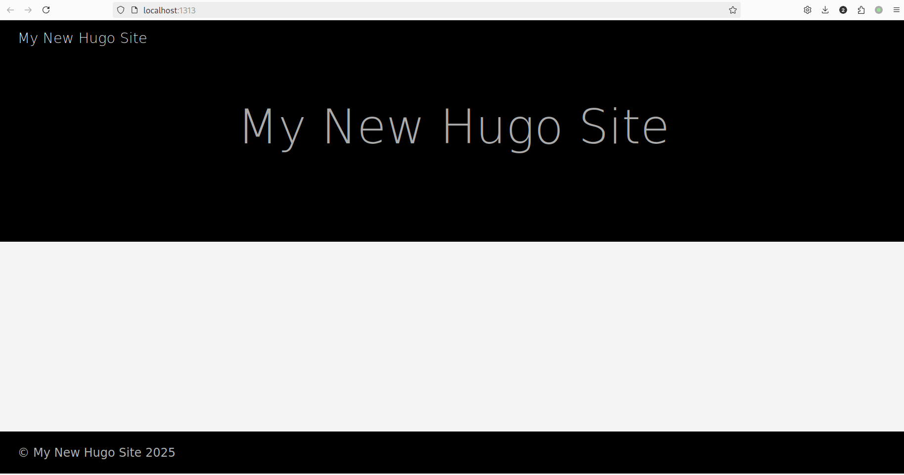
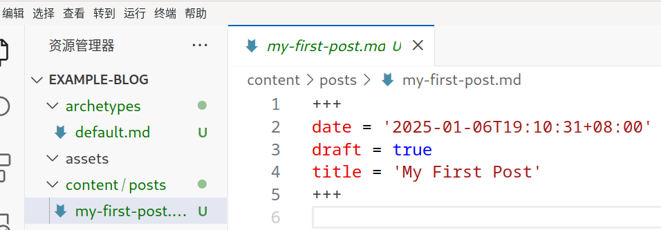
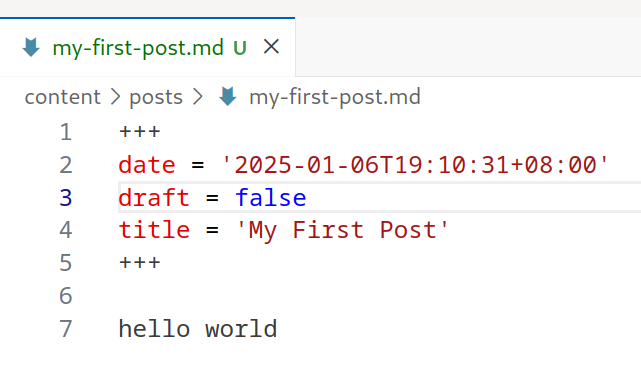
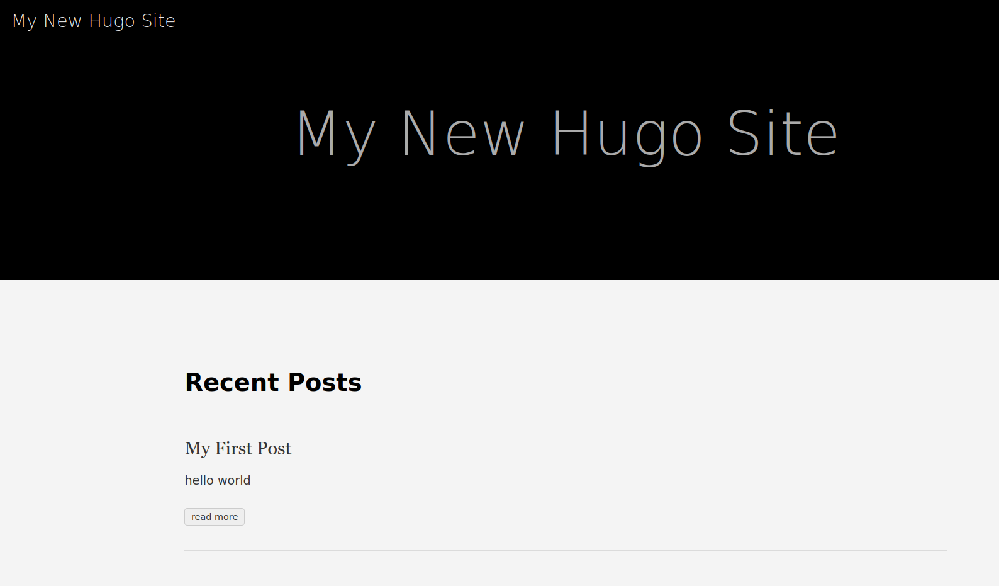
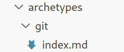
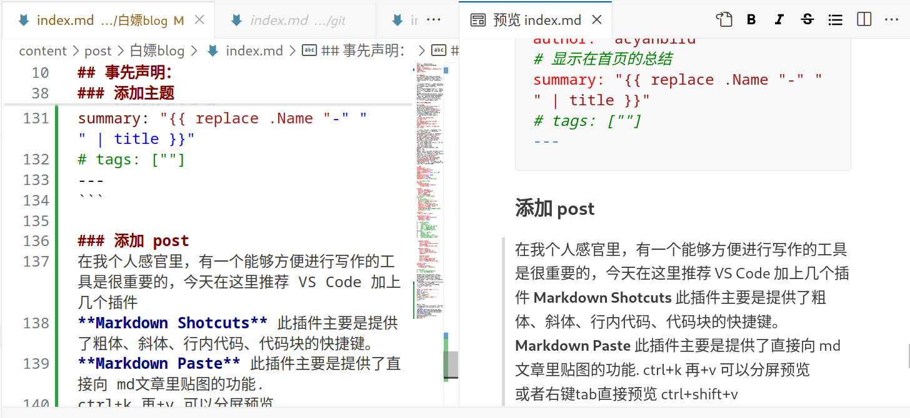
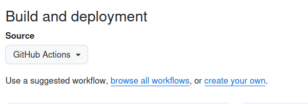

## 事先声明：
作为 blog 搭建……大概5代目，自己搭建的WordPress，白嫖的hexo，CSDN，飞书，或者直接typora 本地存盘都有过。不过可持续性非常烂，导致那么多年基本上没什么存档下来 :sob:  

所以本人比较在意可持续性和存档性。个人搭建 VPS 的缺点在于，一段时间懒惰不续费之后，没有转移的资料丢了就是丢了（看向 WordPress  
如果太难编辑，比如需要自己手动上传图片到图床，再粘贴链接什么的……也不利于持续性的blog写作（一开始觉得没问题总有一天会咆哮很麻烦！）  
无法私有平台固然不错，但是限制太多，还是把资料掌握在自己手里最好！比如我的CSDN账号是什么来着？   因此又跑回来折腾啦！这次有GitHub作为存档保底，自动集成，VSC 的 markdown 支持 ~~主要是能够复制粘贴图片~~ 顺便搞定一下墙内访问就完事大吉~

### 仅供参考
可以查看这个[示例配置](https://github.com/acyanbird/acyanbird.github.io)，不过具体配置都在下面贴的很清楚啦！要是有什么结构问题再来看看这个示例站点吧~

### 太长不看快速上手版
确保你安装了最新的 hugo with extended，配置好 git，新建了 <用户名>.github.io 仓库（比如我的是 acyanbird.github.io）在setting 里面配置 pages - source - github actions。点击进入[仓库](https://github.com/acyanbird/acyanbird.github.io)，请使用命令 `git@github.com:acyanbird/acyanbird.github.io.git` 不要使用 ZIP，这样无法加载 submodule 会导致错误
可以将进入这个目录（比如你重命名为了my-blog），那么在my-blog下面打开终端，输入
```bash
rm -rf .git
git init
git add .
git commit -m "init"
git branch -M main
git remote add origin 你的 URL
git push -u origin main
```

### 搭建站点
按照官方教程的 [quickstart](https://gohugo.io/getting-started/quick-start/)，首先确认安装了 git 和 hugo，hugo 的话最好在 [GitHub release](https://github.com/gohugoio/hugo/releases) 安装最新的 with extended 版本，包管理器安装的也许会过老。  
我们先用官方教程确保站点被正常启动
```bash
hugo new site example-blog
cd example-blog
git init
git submodule add https://github.com/theNewDynamic/gohugo-theme-ananke.git themes/ananke
echo "theme = 'ananke'" >> hugo.toml
hugo server
```
嘛 ananke 主题是比较简单不需要很多配置的，所以可以用这个检测是否能跑通。
  
这个时候就可以用 VS Code 打开站点文件夹 —— 这里就是 example 文件夹，尝试创建一个 blog，在终端里使用 `hugo new content content/posts/my-first-post.md` 你可以在 content 里面看到创建的 post，这里使用了 archetype 的参数
  
还是 draft 的时候显示不出来，我们加点什么再把 draft 设置成 false 


到此就算是测试完毕，接下来我们接入 GitHub 主题
### 添加主题
大家不一定要使用我选择的主题，可以在[官网](https://themes.gohugo.io/)搜索自己想要的主题进行添加，但注意每个主题的配置都各不相同，这一段只对 [github-style](https://github.com/MeiK2333/github-style) 这个 theme 有效。直接添加主题 `git submodule add git@github.com:MeiK2333/github-style.git themes/github-style` 作者是给了一份配置参考，当然我也进行了一些修改，大家可以照抄我的配置，启用了本地搜索功能

```toml
baseURL = "/"
languageCode = "zh-cn"
title = "Nighthawk's nest"
theme = "github-style"
pygmentsCodeFences = true   # 启动代码高亮
pygmentsUseClasses = false
buildDrafts = false
PygmentsStyle = "tango"
enableEmoji = true  # 支持 emoji

# 在 md 里面启用 HTML 
[markup]
  [markup.goldmark]
    [markup.goldmark.renderer]
      unsafe = true

[params]
  author = "你的名字"
  description = "你的描述"
  github = "GitHub ID"
  email = "邮箱"
  url = "个人网站地址"
#   keywords = "blog, google analytics"
  # rss = true
  # userStatusEmoji = "😀"
  favicon = "/images/ava_c_trans.png" #标签页的那个小图标
  avatar = "/images/ava_c.png"
  headerIcon = "/images/ava_c.png"
  location = "Shenzhen, China"
  enableGitalk = false
  # 支持本地搜索，这里与下面的 outputs
  enableSearch = true

[outputs]
  home = ["html", "json"]

[outputFormats.json]
  mediaType = "application/json"
  baseName = "index"
  isPlainText = false

#   [params.gitalk]
#     clientID = ""
#     clientSecret = ""
#     repo = "存放评论的 repo 名"
#     owner = "你的GitHub ID"
#     admin = "你的GitHub ID"
#     id = "decodeURI(location.pathname)"
#     labels = "gitalk"
#     perPage = 15
#     pagerDirection = "last"
#     createIssueManually = false
#     distractionFreeMode = false


  [[params.links]]
    title = "bilibili"
    href = "https://space.bilibili.com/205319947"
    icon = "/images/bilibili.svg"

  [[params.links]]
    title = "QQ Group"
    icon = "/images/qq.svg"
    href = "https://qm.qq.com/q/cXb0hh1uC"

    [[params.links]]
    title = "ebird"
    href = "https://ebird.org/profile/MjQ3NDIyOQ/world"
    icon = "/images/ebirdicon.png"

lastmod = true
[frontmatter]
  lastmod = ["lastmod", ":fileModTime", ":default"]

# [services]
#   [services.googleAnalytics]
#     ID = "UA-123456-789"
```
将images放置在 static下，就像 static/images/image.png 这样，hugo 才能够索引到图片。这个主题接受 content 下的一个 readme.md 以及 content/post/ 文件夹下的 md 文件（所以之前创建的 posts 文件夹要重命名）。  
为了更整齐地归纳 post 里面的图片，我选择给每一个 post 创建一个文件夹。  
在 archetypes 文件夹下再建立模版文件

```yaml
---
title: "{{ replace .Name "-" " " | title }}"
date: {{ .Date }}
draft: false
author: "acyanbird"
# 显示在首页的总结
summary: "{{ replace .Name "-" " " | title }}"
# tags: [""]
---
```

### 添加 post
由于我们使用了 archetype，所以可以用 `hugo new post/[你的题目] --kind git` 初始化一个blog，这样之后的图片放在这个文件夹下就可以啦~  
在我个人感觉里，有一个能够方便进行写作的工具是很重要的，今天在这里推荐 VS Code 加上几个插件：  
**Markdown Shotcuts** 此插件主要是提供了粗体、斜体、行内代码、代码块的快捷键。    
**Markdown Paste** 此插件主要是提供了直接向 md文章里贴图的功能。  
ctrl+k 再+v 可以分屏预览  
  
Readme 文档的写作格式网上有很多资料，也比较方便入门，在此就不赘述啦！  
写完之后直接一个 `git add . && git commit -m "更新笔记" && git push` 走起~  
目前问题：似乎 last mod 功能消失了，到时候找找是哪里出问题（）

### 上线博客
我们使用 github Page 服务进行托管，这个主题目前（可能我会修咕咕咕）有个问题，不支持在有子目录的情况下显示头像图片。所以我们需要使用 <用户名>.github.io 的repo。创建这个名字的repo名称，添加这个 repo。就比如我的GitHub ID 是 acyanbird，所以我的 repo 名是 acyanbird.github.io
```bash
git init
git add .
git commit -m "first commit"
git branch -M main
git remote add origin 你的URL
git push -u origin main
```
之后启动 GitHub Page，这里[官方文档](https://gohugo.io/hosting-and-deployment/hosting-on-github/)写的很清楚了，setting - pages 

在根目录创建 .github/workflows 文件夹，创建 hugo.yaml
```bash
mkdir -p .github/workflows
touch hugo.yaml
```
照抄一下官方文档就好
```yaml
# Sample workflow for building and deploying a Hugo site to GitHub Pages
name: Deploy Hugo site to Pages

on:
  # Runs on pushes targeting the default branch
  push:
    branches:
      - main

  # Allows you to run this workflow manually from the Actions tab
  workflow_dispatch:

# Sets permissions of the GITHUB_TOKEN to allow deployment to GitHub Pages
permissions:
  contents: read
  pages: write
  id-token: write

# Allow only one concurrent deployment, skipping runs queued between the run in-progress and latest queued.
# However, do NOT cancel in-progress runs as we want to allow these production deployments to complete.
concurrency:
  group: "pages"
  cancel-in-progress: false

# Default to bash
defaults:
  run:
    shell: bash

jobs:
  # Build job
  build:
    runs-on: ubuntu-latest
    env:
      HUGO_VERSION: 0.137.1
    steps:
      - name: Install Hugo CLI
        run: |
          wget -O ${{ runner.temp }}/hugo.deb https://github.com/gohugoio/hugo/releases/download/v${HUGO_VERSION}/hugo_extended_${HUGO_VERSION}_linux-amd64.deb \
          && sudo dpkg -i ${{ runner.temp }}/hugo.deb          
      - name: Install Dart Sass
        run: sudo snap install dart-sass
      - name: Checkout
        uses: actions/checkout@v4
        with:
          submodules: recursive
          fetch-depth: 0
      - name: Setup Pages
        id: pages
        uses: actions/configure-pages@v5
      - name: Install Node.js dependencies
        run: "[[ -f package-lock.json || -f npm-shrinkwrap.json ]] && npm ci || true"
      - name: Build with Hugo
        env:
          HUGO_CACHEDIR: ${{ runner.temp }}/hugo_cache
          HUGO_ENVIRONMENT: production
          TZ: America/Los_Angeles
        run: |
          hugo \
            --gc \
            --minify \
            --baseURL "${{ steps.pages.outputs.base_url }}/"          
      - name: Upload artifact
        uses: actions/upload-pages-artifact@v3
        with:
          path: ./public

  # Deployment job
  deploy:
    environment:
      name: github-pages
      url: ${{ steps.deployment.outputs.page_url }}
    runs-on: ubuntu-latest
    needs: build
    steps:
      - name: Deploy to GitHub Pages
        id: deployment
        uses: actions/deploy-pages@v4
```
**顺手优化**： 这个选做，这样发布是不需要 public 文件夹的，我们可以让git忽略这个文件夹，来加快每次上传的速度。在根目录下创建 .gitignore 文件，加入 public/ ，如果之前 add 过这个文件夹那么在根目录下 `git rm -r --cached public`，再提交（git add . && git commit -m "commit message"）  
到此你的 blog 已经可以上线并访问啦！耶！不过还有能够改进的地方，如果还有兴趣就向下看看吧~
### 个性化域名&墙内访问
### enable 评论
这个主题适配了 [gitalk](https://github.com/gitalk/gitalk) 组建，所以就使用这个啦~ 因为需要 callback URL 所以需要上线之后才能使用。