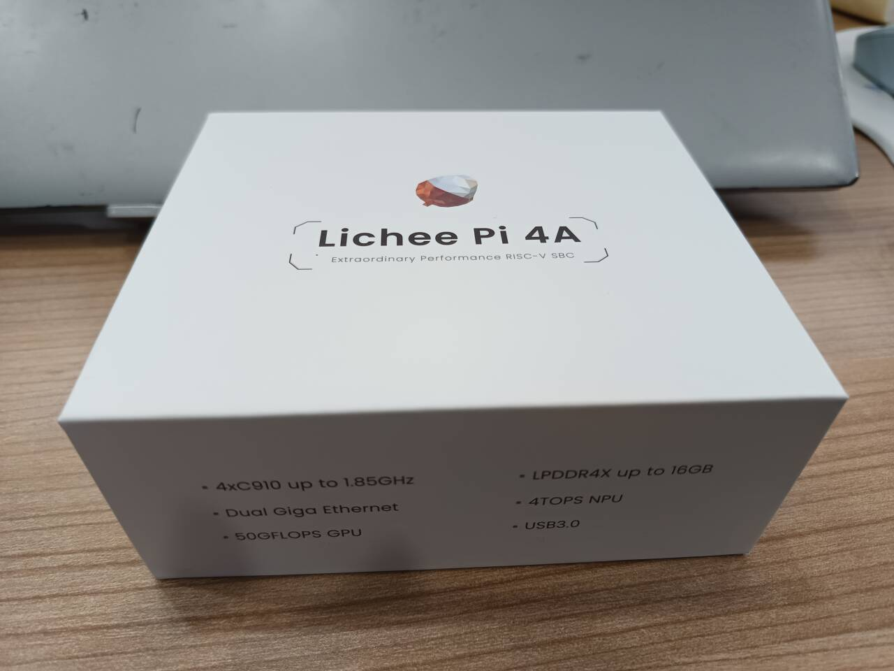
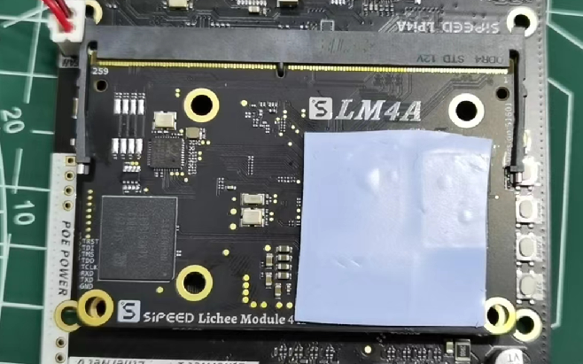
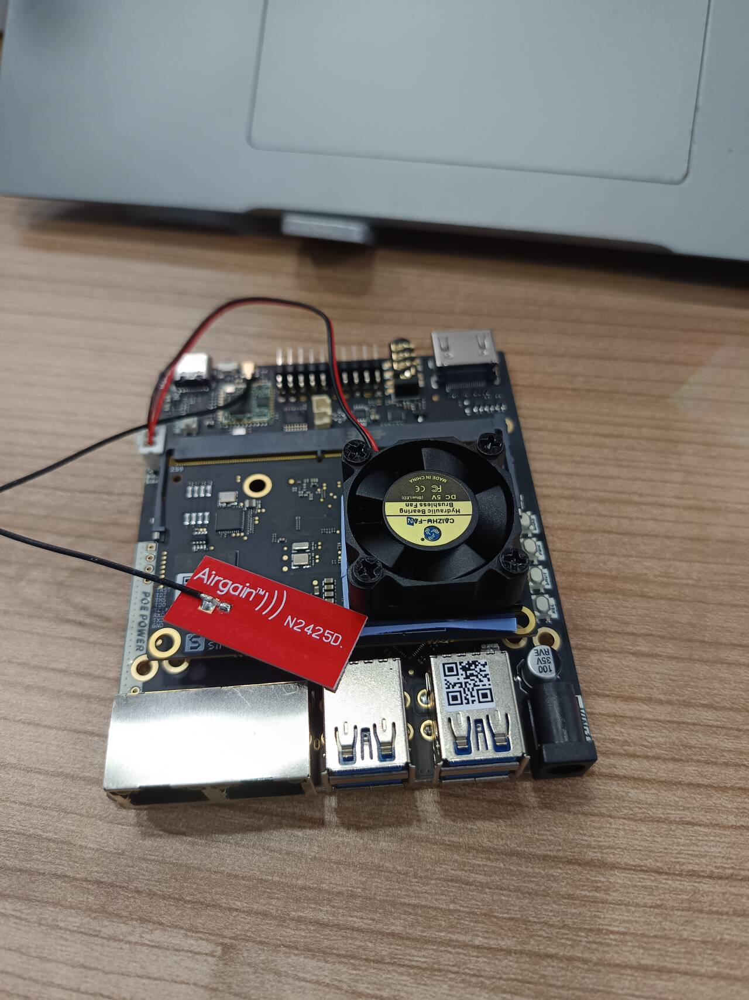
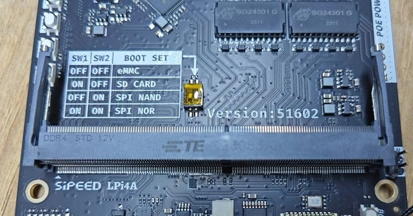
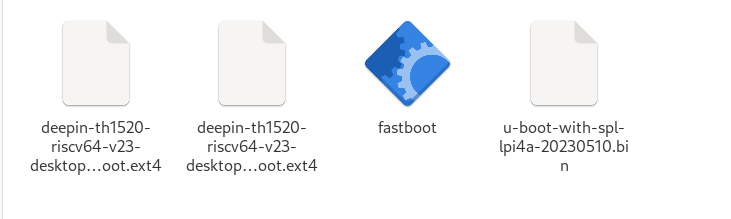

### 开机前拼装

需要自备鼠标键盘显示器，然后连接风扇什么的  

嵌入式？ [GitHub资源](https://github.com/aiminickwong/licheepi4a-images)  
[官网介绍](https://wiki.sipeed.com/hardware/zh/lichee/th1520/lpi4a/1_intro.html)

首先放几张图吧！  

确保 Wi-Fi 天线连接是正常的，som 也好好在板子上连接了，然后装风扇 —— 覆盖住SOM上的三个芯片



一切没有问题插入键盘鼠标之后，就可以直接点亮看看它的预装系统了。然后就到了装镜像环节……

### 安装第三方镜像
好吧无论是不是第三方，都需要用 [fastboot 工具](https://pan.baidu.com/e/1xH56ZlewB6UOMlke5BrKWQ)进行烧录(用 burn tool support big image 这个)。我们需要 uboot，root 分区和 boot 分区。官方给的uboot 比较老了，可以使用[这个](https://ci.deepin.com/repo/deepin/deepin-ports/cdimage/latest/riscv64/bootloaders/uboot-th1520-revyos.zip)。  
把SOM拔下来查看在 emmc 模式

然后摁着boot，插入自带的 type c - USB 线，插入之后再松手！在Terminal 输入 `lsusb` 查看设备，如果有 `Bus 003 Device 009: ID 2345:7654 T-HEAD USB download gadget` 那就是成功了。  
把所有文件弄在一个文件夹里面


```bash
sudo ./fastboot flash ram ./u-boot-with-spl-lpi4a-20230510.bin
sudo ./fastboot reboot
sleep 1
sudo ./fastboot flash uboot ./u-boot-with-spl-lpi4a-20230510.bin
sudo ./fastboot flash boot ./deepin-th1520-riscv64-v23-desktop-installer.boot.ext4
sudo ./fastboot flash root ./deepin-th1520-riscv64-v23-desktop-installer.root.ext4
```
