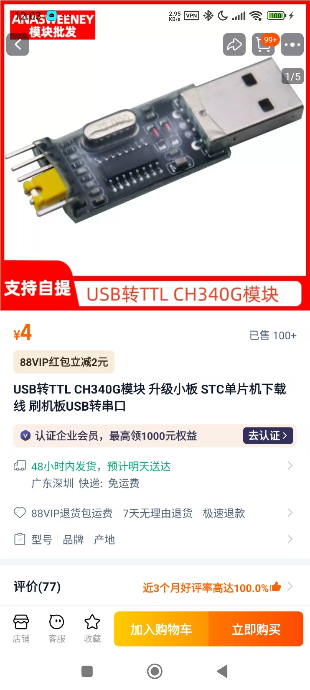

### 开机前拼装

需要自备鼠标键盘显示器，然后连接风扇什么的  

嵌入式？ [GitHub资源](https://github.com/aiminickwong/licheepi4a-images)  
[官网介绍](https://wiki.sipeed.com/hardware/zh/lichee/th1520/lpi4a/1_intro.html)

首先放几张图吧！  

确保 Wi-Fi 天线连接是正常的，som 也好好在板子上连接了，然后装风扇 —— 覆盖住SOM上的三个芯片


一切没有问题插入键盘鼠标之后，就可以直接点亮看看它的预装系统了。然后就到了装镜像环节……

### 安装第三方镜像
好吧无论是不是第三方，都需要用 [fastboot 工具](https://pan.baidu.com/e/1xH56ZlewB6UOMlke5BrKWQ)进行烧录(用 burn tool support big image 这个)。我们需要 uboot，root 分区和 boot 分区。官方给的uboot 比较老了，可以使用[这个](https://ci.deepin.com/repo/deepin/deepin-ports/cdimage/latest/riscv64/bootloaders/uboot-th1520-revyos.zip)。  
把SOM拔下来查看在 emmc 模式

然后摁着boot，插入自带的 type c - USB 线，插入之后再松手！在Terminal 输入 `lsusb` 查看设备，如果有 `Bus 003 Device 009: ID 2345:7654 T-HEAD USB download gadget` 那就是成功了。  
把所有文件弄在一个文件夹里面


```bash
sudo ./fastboot flash ram ./u-boot-with-spl.bin
sudo ./fastboot reboot
sleep 1
sudo ./fastboot flash uboot ./u-boot-with-spl.bin
sudo ./fastboot flash boot ./deepin-th1520-riscv64-v23-desktop-installer.boot.ext4
sudo ./fastboot flash root ./deepin-th1520-riscv64-v23-desktop-installer.root.ext4
```
但是出现问题了……让我们用串口看看  
不用串口！是 fastboot 版本的问题，上次放错了

### 使用串口连接
购买一个串口转 USB 模块

嗯我买的是这个，还有母对母的杜邦线，之后按照这里的[官方文档](https://wiki.sipeed.com/hardware/zh/lichee/th1520/lpi4a/6_peripheral.html#UART)的提示组装   
结果用上了但是没有完全用上

### debug
之前换了fastboot 之后上电工作了，但是安装到一半就崩溃……可以直接切换 tty 查看 log ctrl+alt+f<2-6> 反正多试几个，就能切换到能用 tty3 或者 4什么的……默认root 密码是 deepin，log 在 ` /var/log/deepin-installer/deepin-installer` 找，里面的 `deepin-installer-first-boot.log`

看到的问题是 `/etc/apt/source.list` 有 `DI_APT_SOURCE_DEB` 我把他更改成 deb 开头。然后记得删除曾经创建的用户 `userdel -r testuser` 之后 
```bash
systemctl restart deepin-installer-first-boot.service 
systemctl restart lightdm.service
``` 
然而没用！改回来又会被改回去！需要更改 需要改 /etc/deepin-installer/ 下面的 conf，注释掉 apt_source_deb 这一行的东西，再次重启！  

进去了qwq

### 配置系统
首先，没有中文输入法，然后软件源不对（）被解析到内网了，所以改一下host
在 `/etc/hosts` 里面加入一行 `61.183.83.58 ci.deepin.com`
