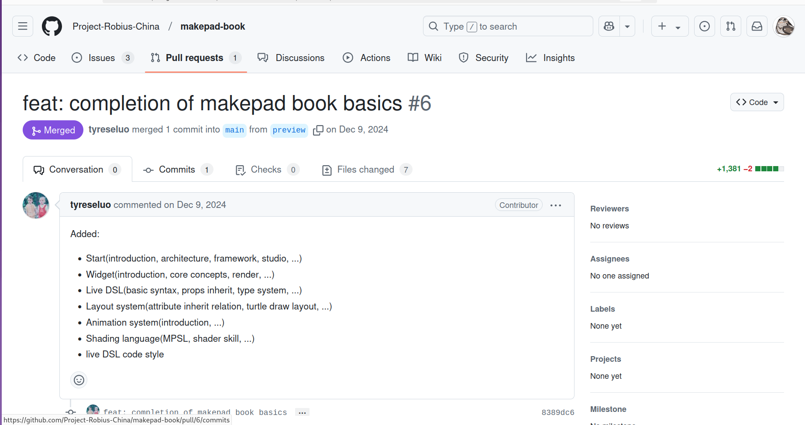

### 贡献方式
[项目地址](https://project-robius-china.github.io/makepad-book/guide/start/introduction)  
[贡献指南](https://project-robius-china.github.io/makepad-book/contribute/index)  
PR 标题遵循 [Conventional Commits](https://www.conventionalcommits.org/en/v1.0.0/) 

### 开发环境搭建
install pnpm, `sudo npm install -g pnpm` 之后 clone preview branch 
```bash
pnpm install  # 安装依赖
pnpm run dev  # 启动项目
```

### 给个 example
比如说要 update 这里的 [online example](https://project-robius-china.github.io/makepad-book/guide/start/app-examples#online) 那么fork到本地，添加 branch 比如
```bash
git checkout -b update/change-online-example-links
#修改内容之后
git add
git commit -m "update: change online example links"
```
当然也可以在 PR 的 description 里面加入内容
