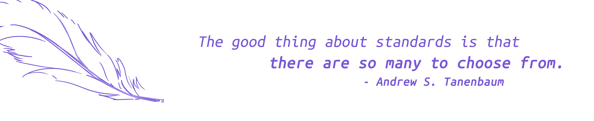
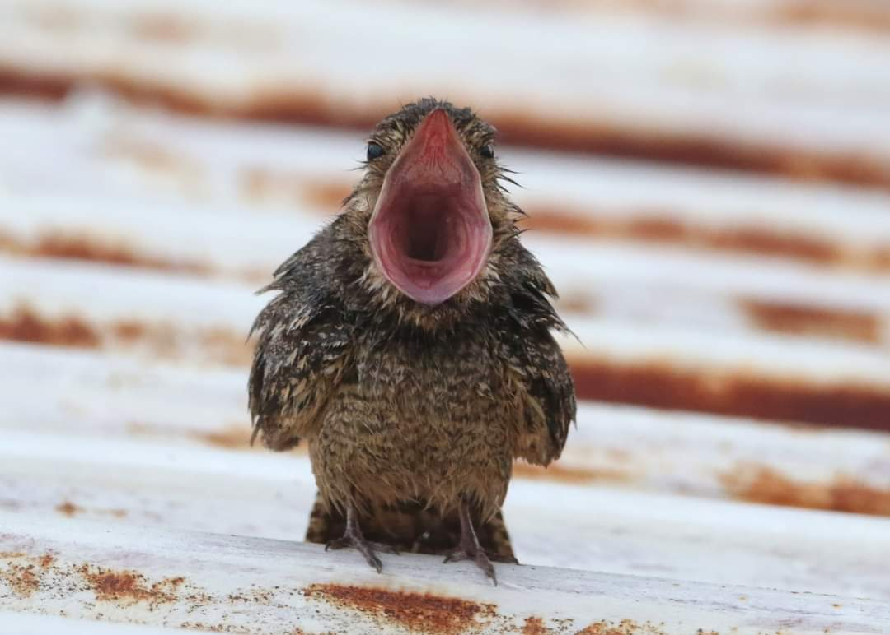

# 💫About Me :
she / her / hers  超级喜欢开源社区的夜鹰一只啊！Linux 桌面日常玩家（Debian），什么都折腾一点，目前在给 Deepin 打工啾啾啾。珍惜生命远离折腾（但还是在折腾）  
欢迎加入 COSSIG 社区来吹水！大家一起玩~  
我也是个观鸟人！欢迎查看我的 ebird 界面啾！（查看左下 organization）

# License
本博客所有内容，除了其他人贡献以及特殊标注之外均采用 [WTFPL – Do What the Fuck You Want to Public License](http://www.wtfpl.net/) 当然如果你能给我署名一下我会更开心！！！
  

## 友情链接
- [白鼠Cysnies](https://blog.tcea.top)
- [一粒 qaqland](https://qaq.land)
- [John Cage](https://coshcage.github.io/)

# 💻Tech Stack
     

# 📊GitHub Stats :
 
 

### ✍️ Not Random Motto
#####   
### 🪶 Not Random Nighthawk Shouting

---

